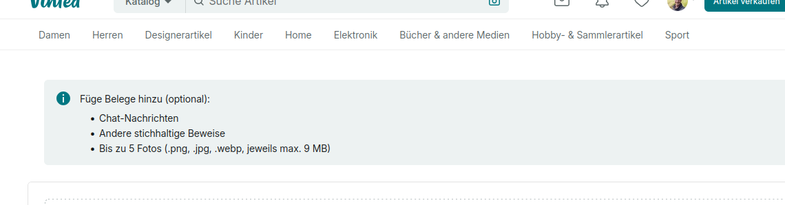

# MeasureBox

MeasureBox is a Linux X11 desktop overlay tool for web developers.
It lets you draw persistent rectangles on top of any app and displays live pixel measurements.



## Features

- Global mode hotkeys: `Ctrl+Shift+D` or `Ctrl+Shift+R` (Draw), `Ctrl+Shift+P` or `Ctrl+Shift+S` (Pass-through)
- Single active rectangle (prepared for future multi-rectangle extension)
- Move and resize rectangles with 8 handles
- Label shows `x`, `y`, `w`, `h` in pixels
- Click-through mode outside edit mode
- Line and fill color with independent alpha channel
- Settings persistence in `~/.config/measurebox/config.json`
- Optional autostart via `~/.config/autostart/measurebox.desktop`

## Installation

```bash
cd /home/joruf/Applications/measurebox
python3 install_dependencies.py
```

The installer also tries to install required Linux Qt/X11 system packages (for example `libxcb-cursor0` on Debian/Ubuntu based distributions). It may prompt for `sudo`.

## Run

```bash
cd /home/joruf/Applications/measurebox
./start_measurebox.sh
```

`start_measurebox.sh` prints clear status messages, installs dependencies when needed, and starts the app with `.venv/bin/python`.
When dependencies are missing, MeasureBox can also auto-run `install_dependencies.py` and restart with `.venv/bin/python`.
During first-time setup, a small GUI window shows installation progress (disable with `MEASUREBOX_INSTALL_GUI=0`).

## Desktop/Autostart Launcher

Use the desktop-oriented launcher when integrating with login/autostart:

```bash
cd /home/joruf/Applications/measurebox
./start_measurebox_desktop.sh
```

It writes startup and error logs to:

- `~/.local/state/measurebox/startup.log` (or `$XDG_STATE_HOME/measurebox/startup.log`)

Autostart entries created from MeasureBox tray now use this launcher automatically.

## Usage

- Switch to Draw Mode with `Ctrl+Shift+D` (fallback: `Ctrl+Shift+R`)
- Switch to Pass-through Mode with `Ctrl+Shift+P` (fallback: `Ctrl+Shift+S`, background apps receive scroll/click input)
- Press `Esc` to clear all rectangles from the screen
- In edit mode:
  - Drag on empty area to draw one rectangle
  - Drag rectangle to move it
  - Drag handles on edges/corners to resize
  - Press `Delete` to remove selected rectangle
  - Pointer on rectangle border automatically enables interaction
- Clicking beside the rectangle switches to pass-through mode

## Automated Tests

```bash
cd /home/joruf/Applications/measurebox
.venv/bin/python -m pytest -q
```

## Notes

- This tool targets Linux X11 sessions.
- Global hotkey handling relies on `pynput`.
