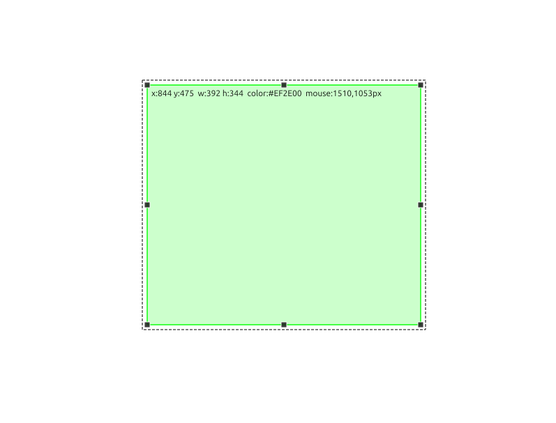
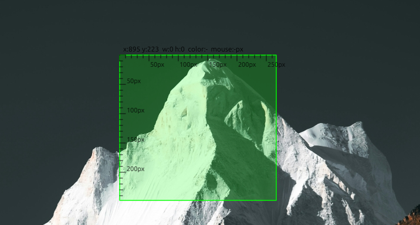

# MeasureBox

MeasureBox is a Linux X11 desktop overlay tool for web developers.
It lets you draw persistent rectangles on top of any app and displays live pixel measurements.





## Features

- Global mode hotkeys: `Ctrl+Shift+D` or `Ctrl+Shift+R` (Draw), `Ctrl+Shift+P` or `Ctrl+Shift+S` (Pass-through)
- Single active rectangle (prepared for future multi-rectangle extension)
- Move and resize rectangles with 8 handles
- Label shows `x`, `y`, `w`, `h` in pixels
- Click-through mode outside edit mode
- Line and fill color with independent alpha channel
- Settings persistence in `~/.config/measurebox/config.json`
- Optional autostart via `~/.config/autostart/measurebox.desktop`

## Usage

```bash
git clone https://github.com/joruf/measurebox.git
cd measurebox
chmod +x measurebox.py
./measurebox.py
```

On first start, MeasureBox installs missing dependencies automatically (Python packages and Linux Qt/X11 libraries). A small setup window may appear.

- Switch to Draw Mode with `Ctrl+Shift+D` (fallback: `Ctrl+Shift+R`)
- Switch to Pass-through Mode with `Ctrl+Shift+P` (fallback: `Ctrl+Shift+S`, background apps receive scroll/click input)
- Press `Esc` to clear all rectangles from the screen
- In edit mode:
  - Drag on empty area to draw one rectangle
  - Drag rectangle to move it
  - Drag handles on edges/corners to resize
  - Press `Delete` to remove selected rectangle
  - Pointer on rectangle border automatically enables interaction
- Clicking beside the rectangle switches to pass-through mode
- Optional autostart: enable **Enable Autostart** in the tray menu

## Automated Tests

```bash
.venv/bin/python -m pytest -q
```

## Notes

- This tool targets Linux X11 sessions.
- Global hotkey handling relies on `pynput`.
